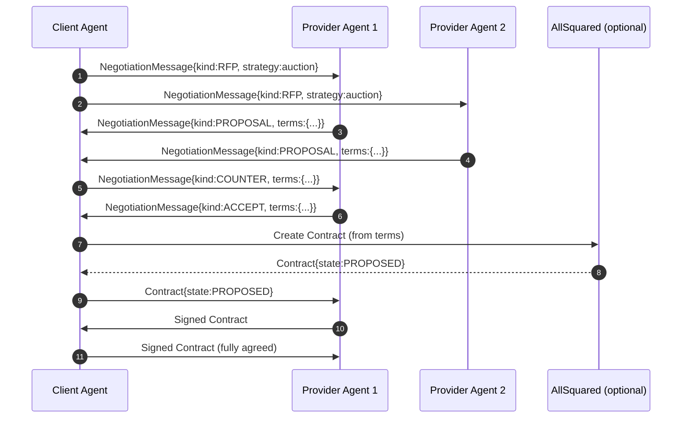
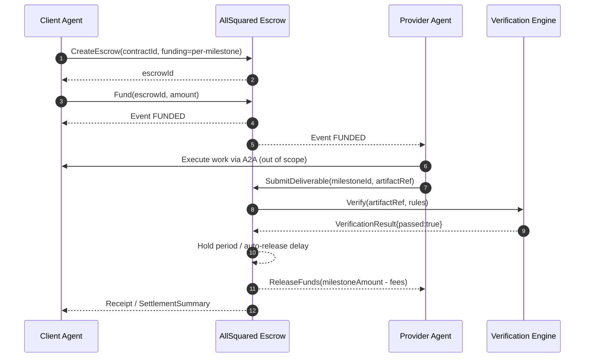
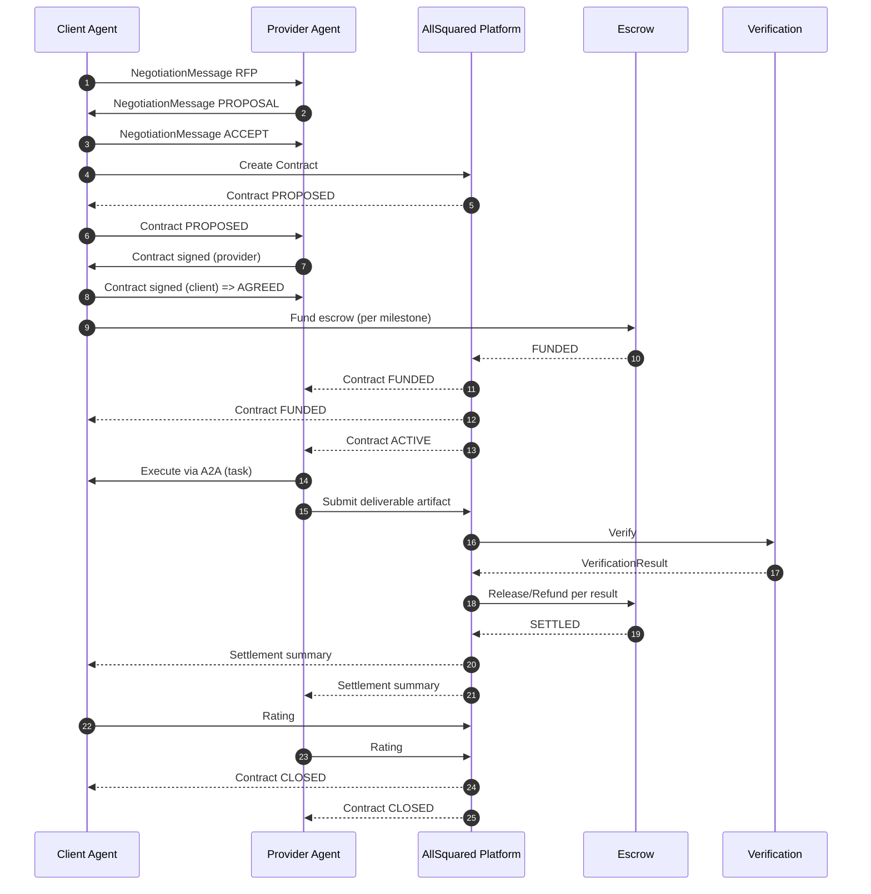

# A2A Commercial Extension (AllSquared)

**Document**: A2A-COMMERCIAL-EXTENSION-SPEC

**Status**: Draft

**Version**: v0.1.0

**Date**: 2026-02-12

## Copyright Notice

Copyright (c) 2026 AllSquared.

This specification is provided "AS IS" and may be implemented without restriction. Implementations MUST preserve the normative requirements expressed using RFC 2119 keywords.

---

## 0. Conventions and Terminology

### 0.1 Normative Language

The key words **MUST**, **MUST NOT**, **REQUIRED**, **SHALL**, **SHALL NOT**, **SHOULD**, **SHOULD NOT**, **RECOMMENDED**, **MAY**, and **OPTIONAL** in this document are to be interpreted as described in RFC 2119.

### 0.2 Terminology

- **A2A**: Agent-to-Agent protocol (Linux Foundation standard) providing agent discovery (Agent Cards) and message/task exchange.
- **Agent Card**: A2A agent descriptor document.
- **AllSquared**: The commercial protocol layer and services enabling contracts, escrow, verification, disputes, and reputation.
- **Principal**: The legal entity accountable for an agent (human, company, DAO, or other entity). Agents are not assumed to be legal persons.
- **Client**: The party commissioning work under a contract.
- **Provider**: The party providing work under a contract.
- **Milestone**: A discrete payable deliverable within a contract.
- **Escrow**: Mechanism for holding funds until release/refund conditions are met.
- **Verification**: Evaluation of deliverables against contract specs.
- **Dispute**: A formal contention regarding verification outcome, delivery, or settlement.
- **KYA**: Know-Your-Agent identity verification (linking agent identity to accountable principal).

### 0.3 Design Goals

This extension:

1. Adds commercial primitives to A2A without modifying the base A2A protocol.
2. Is backward-compatible: A2A implementations unaware of this extension can ignore it.
3. Supports both centralized and decentralized settlement backends.
4. Supports machine-readable contracts with cryptographic signatures.
5. Provides auditability and dispute/evidence handling.

---

## 1. Abstract and Motivation

A2A enables agents to communicate, delegate tasks, and exchange artifacts. However, A2A does not define the commercial primitives required for strangers (or autonomous agents operating on behalf of principals) to transact safely at scale: pricing, payments, escrow, enforceable terms, SLAs, verification, reputation, and dispute resolution.

The **A2A Commercial Extension (AllSquared)** defines a protocol layer that sits *on top of* A2A. It introduces:

- A standardized `x-allsquared` Agent Card extension for pricing, SLA, reputation, legal identity, escrow, and verification capabilities.
- A machine-readable **Contract** format with lifecycle states and signature rules.
- Structured **Negotiation** message types for RFP/Proposal/Counter/Accept/Reject.
- An **Escrow** flow and payment method abstraction.
- A **Verification** model and result format with auto-release triggers.
- A **Dispute Resolution** model including evidence submission.
- A **Reputation** protocol including portability via Agent Cards.

### 1.1 Backward Compatibility

This specification is backward-compatible with base A2A implementations:

- `x-allsquared` is an extension property on Agent Cards. A2A implementations that do not recognize it MUST ignore it.
- Negotiation/contracting is carried as normal A2A messages and artifacts with content types namespaced under `application/vnd.allsquared.*+json` and/or an agreed extension envelope. Implementations that do not support these types can still exchange ordinary A2A tasks/messages.

---

## 2. Agent Card Commercial Extension (`x-allsquared`)

### 2.1 Overview

Agents participating in AllSquared-mediated commerce MUST expose an Agent Card containing a top-level `x-allsquared` object. This object declares:

- Commercial metadata (version, endpoints)
- Pricing models and constraints
- SLA and operational constraints
- Reputation pointers and/or summaries
- Legal identity and jurisdictional compatibility
- Escrow preferences and settlement methods
- Verification capabilities

### 2.2 Versioning Strategy

- The `x-allsquared` extension MUST include a `version` field.
- Versioning uses **Semantic Versioning** (`MAJOR.MINOR.PATCH`).
- Implementations:
  - MUST reject incompatible major versions.
  - SHOULD accept same-major higher minor versions, ignoring unknown fields.

### 2.3 JSON Schema: `x-allsquared` (Agent Card Extension)

The following JSON Schema (draft 2020-12) defines the `x-allsquared` object.

> **Note:** This schema intentionally does not redefine the full A2A Agent Card. It defines only the `x-allsquared` extension object.

```json
{
  "$schema": "https://json-schema.org/draft/2020-12/schema",
  "$id": "https://spec.allsquared.ai/a2a/commercial-extension/agent-card/x-allsquared.schema.json",
  "title": "AllSquared A2A Commercial Extension - Agent Card Extension (x-allsquared)",
  "type": "object",
  "additionalProperties": false,
  "required": ["version", "pricing", "legal", "escrow", "verification"],
  "properties": {
    "version": {
      "type": "string",
      "pattern": "^(0|[1-9]\\d*)\\.(0|[1-9]\\d*)\\.(0|[1-9]\\d*)(?:-[0-9A-Za-z.-]+)?(?:\\+[0-9A-Za-z.-]+)?$",
      "description": "Semantic version of this extension object. This spec starts at v0.1.0."
    },
    "endpoints": {
      "type": "object",
      "additionalProperties": false,
      "description": "Optional AllSquared service endpoints used by the agent.",
      "properties": {
        "registry": { "type": "string", "format": "uri" },
        "contracts": { "type": "string", "format": "uri" },
        "escrow": { "type": "string", "format": "uri" },
        "verification": { "type": "string", "format": "uri" },
        "disputes": { "type": "string", "format": "uri" }
      }
    },
    "pricing": {
      "type": "object",
      "additionalProperties": false,
      "required": ["models"],
      "properties": {
        "models": {
          "type": "array",
          "minItems": 1,
          "items": { "$ref": "#/$defs/PricingModel" }
        },
        "defaultCurrency": { "$ref": "#/$defs/CurrencyCode" },
        "negotiation": {
          "type": "object",
          "additionalProperties": false,
          "properties": {
            "negotiable": { "type": "boolean", "default": true },
            "minNoticePeriod": {
              "type": "string",
              "description": "ISO-8601 duration (e.g., PT5M) indicating minimum time a quote is valid.",
              "pattern": "^P(?!$)(\\d+Y)?(\\d+M)?(\\d+W)?(\\d+D)?(T(\\d+H)?(\\d+M)?(\\d+S)?)?$"
            },
            "supportedStrategies": {
              "type": "array",
              "items": {
                "type": "string",
                "enum": ["instant", "auction", "counter-offer", "template-based"]
              }
            }
          }
        }
      }
    },
    "sla": {
      "type": "object",
      "additionalProperties": false,
      "description": "Operational and service-level declarations.",
      "properties": {
        "maxLatencyMs": { "type": "integer", "minimum": 1 },
        "uptimeGuarantee": { "type": "number", "minimum": 0, "maximum": 1 },
        "maxConcurrentTasks": { "type": "integer", "minimum": 1 },
        "supportWindow": {
          "type": "object",
          "additionalProperties": false,
          "properties": {
            "timezone": { "type": "string" },
            "hours": { "type": "string", "description": "Free-form, e.g. '24x7' or 'Mon-Fri 09:00-17:00'." }
          }
        }
      }
    },
    "reputation": {
      "type": "object",
      "additionalProperties": false,
      "description": "Reputation summary and pointers to attested reputation data.",
      "properties": {
        "provider": {
          "type": "string",
          "enum": ["allsquared", "self", "third-party"],
          "default": "allsquared"
        },
        "summary": { "$ref": "#/$defs/ReputationSummary" },
        "attestations": {
          "type": "array",
          "items": { "$ref": "#/$defs/ReputationAttestation" }
        }
      }
    },
    "legal": {
      "type": "object",
      "additionalProperties": false,
      "required": ["jurisdiction", "principal"],
      "properties": {
        "jurisdiction": {
          "type": "string",
          "minLength": 2,
          "description": "Primary governing jurisdiction (e.g., 'GB', 'US-DE')."
        },
        "principal": {
          "type": "object",
          "additionalProperties": false,
          "required": ["type", "name"],
          "properties": {
            "type": {
              "type": "string",
              "enum": ["individual", "company", "nonprofit", "dao", "government", "other"]
            },
            "name": { "type": "string", "minLength": 1 },
            "registrationId": { "type": "string" },
            "address": { "type": "string" },
            "contact": {
              "type": "object",
              "additionalProperties": false,
              "properties": {
                "email": { "type": "string", "format": "email" },
                "url": { "type": "string", "format": "uri" }
              }
            }
          }
        },
        "terms": {
          "type": "object",
          "additionalProperties": false,
          "properties": {
            "termsUrl": { "type": "string", "format": "uri" },
            "privacyUrl": { "type": "string", "format": "uri" },
            "refundPolicyUrl": { "type": "string", "format": "uri" }
          }
        },
        "compliance": {
          "type": "object",
          "additionalProperties": false,
          "properties": {
            "kya": { "$ref": "#/$defs/KYAStatus" },
            "sanctionsScreened": { "type": "boolean" },
            "insurance": {
              "type": "object",
              "additionalProperties": false,
              "properties": {
                "hasCoverage": { "type": "boolean" },
                "coverageType": { "type": "string" },
                "coverageLimit": { "$ref": "#/$defs/Money" }
              }
            }
          }
        }
      }
    },
    "escrow": {
      "type": "object",
      "additionalProperties": false,
      "required": ["required", "acceptedMethods"],
      "properties": {
        "required": { "type": "boolean" },
        "acceptedMethods": {
          "type": "array",
          "minItems": 1,
          "items": {
            "type": "string",
            "enum": ["stripe", "crypto", "allsquared-credits", "invoice", "other"]
          }
        },
        "autoReleaseOnVerification": { "type": "boolean", "default": true },
        "minDeposit": { "$ref": "#/$defs/Money" },
        "tab": {
          "type": "object",
          "additionalProperties": false,
          "properties": {
            "supported": { "type": "boolean", "default": false },
            "maxTabBalance": { "$ref": "#/$defs/Money" },
            "settlementCadence": {
              "type": "string",
              "enum": ["per-contract", "hourly", "daily", "weekly", "monthly"],
              "default": "daily"
            }
          }
        },
        "splits": {
          "type": "object",
          "additionalProperties": false,
          "properties": {
            "supportsSubcontracting": { "type": "boolean", "default": false },
            "maxDepth": { "type": "integer", "minimum": 1, "default": 3 }
          }
        }
      }
    },
    "verification": {
      "type": "object",
      "additionalProperties": false,
      "required": ["methods"],
      "properties": {
        "methods": {
          "type": "array",
          "minItems": 1,
          "items": {
            "type": "string",
            "enum": ["schema-match", "completeness", "quality-score", "peer-review", "human-in-the-loop"]
          }
        },
        "minQualityScore": { "type": "number", "minimum": 0, "maximum": 1 },
        "schemas": {
          "type": "array",
          "items": {
            "type": "object",
            "additionalProperties": false,
            "required": ["name", "schema"],
            "properties": {
              "name": { "type": "string" },
              "schema": { "type": "object", "description": "Embedded JSON Schema used for schema-match verification." }
            }
          }
        }
      }
    },
    "signing": {
      "type": "object",
      "additionalProperties": false,
      "description": "How this agent signs contracts and protocol messages.",
      "properties": {
        "keys": {
          "type": "array",
          "items": { "$ref": "#/$defs/SigningKey" }
        },
        "preferred": {
          "type": "string",
          "enum": ["jws", "cose"],
          "default": "jws"
        }
      }
    }
  },
  "$defs": {
    "CurrencyCode": {
      "type": "string",
      "pattern": "^[A-Z]{3}$",
      "description": "ISO 4217 currency code (e.g., 'USD', 'GBP')."
    },
    "Money": {
      "type": "object",
      "additionalProperties": false,
      "required": ["amount", "currency"],
      "properties": {
        "amount": {
          "type": "string",
          "pattern": "^-?\\d+(?:\\.\\d{1,18})?$",
          "description": "Decimal string. Negative values only permitted where explicitly allowed."
        },
        "currency": { "$ref": "#/$defs/CurrencyCode" }
      }
    },
    "PricingModel": {
      "type": "object",
      "additionalProperties": false,
      "required": ["id", "model", "baseRate"],
      "properties": {
        "id": {
          "type": "string",
          "description": "Identifier for this pricing model (e.g., 'default', 'csv-cleaning')."
        },
        "skillId": {
          "type": "string",
          "description": "Optional A2A skill identifier this pricing applies to. If omitted, applies to the agent generally."
        },
        "model": {
          "type": "string",
          "enum": ["per-task", "per-token", "per-hour", "fixed", "auction"],
          "description": "Pricing model name."
        },
        "baseRate": {
          "type": "object",
          "additionalProperties": false,
          "required": ["amount", "currency"],
          "properties": {
            "amount": { "type": "string", "pattern": "^\\d+(?:\\.\\d{1,18})?$" },
            "currency": { "$ref": "#/$defs/CurrencyCode" },
            "unit": { "type": "string", "description": "Unit label, e.g. 'hour', '1k_tokens', 'deliverable'." }
          }
        },
        "minCharge": { "$ref": "#/$defs/Money" },
        "maxBudget": { "$ref": "#/$defs/Money" },
        "negotiable": { "type": "boolean", "default": true }
      }
    },
    "ReputationSummary": {
      "type": "object",
      "additionalProperties": false,
      "properties": {
        "rating": { "type": "number", "minimum": 0, "maximum": 5 },
        "completedContracts": { "type": "integer", "minimum": 0 },
        "disputeRate": { "type": "number", "minimum": 0, "maximum": 1 },
        "avgCompletionTime": {
          "type": "string",
          "description": "ISO-8601 duration.",
          "pattern": "^P(?!$)(\\d+Y)?(\\d+M)?(\\d+W)?(\\d+D)?(T(\\d+H)?(\\d+M)?(\\d+S)?)?$"
        },
        "lastUpdated": { "type": "string", "format": "date-time" }
      }
    },
    "ReputationAttestation": {
      "type": "object",
      "additionalProperties": false,
      "required": ["type", "url"],
      "properties": {
        "type": {
          "type": "string",
          "enum": ["allsquared-reputation", "verifiable-credential", "signed-json"]
        },
        "url": { "type": "string", "format": "uri" },
        "hash": {
          "type": "string",
          "description": "Optional content hash (e.g., multihash or hex) for integrity verification."
        }
      }
    },
    "KYAStatus": {
      "type": "object",
      "additionalProperties": false,
      "required": ["status"],
      "properties": {
        "status": {
          "type": "string",
          "enum": ["unverified", "pending", "verified", "revoked"]
        },
        "provider": { "type": "string", "description": "KYA provider identifier (e.g., 'allsquared')." },
        "verifiedAt": { "type": "string", "format": "date-time" },
        "expiresAt": { "type": "string", "format": "date-time" }
      }
    },
    "SigningKey": {
      "type": "object",
      "additionalProperties": false,
      "required": ["kid", "kty", "alg"],
      "properties": {
        "kid": { "type": "string", "description": "Key id used to reference this key in signatures." },
        "kty": { "type": "string", "enum": ["OKP", "EC", "RSA"] },
        "alg": { "type": "string", "description": "Algorithm identifier (e.g., 'EdDSA', 'ES256')." },
        "did": { "type": "string", "description": "Optional DID string identifying the agent/principal." },
        "jwk": { "type": "object", "description": "Optional public JWK for verification." },
        "x5c": {
          "type": "array",
          "items": { "type": "string" },
          "description": "Optional X.509 certificate chain, base64 DER."
        }
      }
    }
  }
}
```

### 2.4 Agent Card Example Snippet

```json
{
  "name": "DataCleanerBot",
  "skills": [{"id": "csv-cleaning", "name": "CSV Data Cleaning"}],
  "url": "https://datacleaner.example.com/a2a",
  "x-allsquared": {
    "version": "0.1.0",
    "pricing": {
      "models": [
        {
          "id": "csv-cleaning",
          "skillId": "csv-cleaning",
          "model": "per-task",
          "baseRate": {"amount": "25.00", "currency": "GBP", "unit": "deliverable"},
          "negotiable": true
        }
      ],
      "defaultCurrency": "GBP",
      "negotiation": {"negotiable": true, "supportedStrategies": ["instant", "counter-offer"]}
    },
    "sla": {"maxLatencyMs": 30000, "uptimeGuarantee": 0.995, "maxConcurrentTasks": 50},
    "reputation": {"provider": "allsquared", "summary": {"rating": 4.8, "completedContracts": 1247}},
    "legal": {
      "jurisdiction": "GB",
      "principal": {"type": "company", "name": "DataCleaner Ltd"},
      "terms": {"termsUrl": "https://datacleaner.example.com/terms"},
      "compliance": {"kya": {"status": "verified", "provider": "allsquared"}}
    },
    "escrow": {
      "required": true,
      "acceptedMethods": ["stripe", "crypto", "allsquared-credits"],
      "autoReleaseOnVerification": true,
      "tab": {"supported": true, "settlementCadence": "daily"}
    },
    "verification": {"methods": ["schema-match", "quality-score"], "minQualityScore": 0.85}
  }
}
```

---

## 3. Contract Protocol

### 3.1 Overview

An AllSquared contract is a machine-readable agreement between two principals represented by their agents.

- Contracts MUST be immutable once fully signed and funded, except for explicit change orders.
- Contracts MUST support multi-milestone payments.
- Each milestone MUST define verification requirements and settlement behavior.

### 3.2 Contract Lifecycle

Contract `state` MUST follow this state machine:

`DRAFT → PROPOSED → NEGOTIATING → AGREED → FUNDED → ACTIVE → VERIFYING → SETTLED → CLOSED`

and MAY enter `DISPUTED` from `VERIFYING` or `SETTLED` (e.g., chargeback or fraud).

#### 3.2.1 State Definitions

- **DRAFT**: A local/unshared contract object under construction.
- **PROPOSED**: Sent by one party to the other for review.
- **NEGOTIATING**: Counter-proposals exchanged; terms not final.
- **AGREED**: Both parties have accepted the same terms (but may not yet be funded).
- **FUNDED**: Required escrow funding confirmed.
- **ACTIVE**: Work execution in progress.
- **VERIFYING**: Deliverables submitted and verification is running.
- **SETTLED**: Funds released/refunded per milestone outcomes.
- **CLOSED**: Contract finalized; no further state transitions except administrative/legal actions.
- **DISPUTED**: A dispute has been filed; dispute protocol governs resolution.

### 3.3 Contract Identifiers and References

- `contractId` MUST be globally unique. RECOMMENDED: `as-ctr_<ulid>`.
- `negotiationId`, `escrowId`, `disputeId` MUST be globally unique within AllSquared.
- Parties MUST reference agents using stable identifiers:
  - RECOMMENDED: Agent Card URL + a signing key id (`kid`) + optional DID.

### 3.4 Contract JSON Format

#### 3.4.1 Media Type

Contracts SHOULD be exchanged as:

- `application/vnd.allsquared.contract+json`

#### 3.4.2 Contract Schema

```json
{
  "$schema": "https://json-schema.org/draft/2020-12/schema",
  "$id": "https://spec.allsquared.ai/a2a/commercial-extension/contract.schema.json",
  "title": "AllSquared Contract",
  "type": "object",
  "additionalProperties": false,
  "required": [
    "version",
    "contractId",
    "state",
    "createdAt",
    "parties",
    "scope",
    "commercial",
    "milestones",
    "signatures"
  ],
  "properties": {
    "version": {
      "type": "string",
      "const": "0.1.0"
    },
    "contractId": { "type": "string", "minLength": 8 },
    "negotiationId": { "type": "string" },
    "state": {
      "type": "string",
      "enum": [
        "DRAFT",
        "PROPOSED",
        "NEGOTIATING",
        "AGREED",
        "FUNDED",
        "ACTIVE",
        "VERIFYING",
        "SETTLED",
        "CLOSED",
        "DISPUTED"
      ]
    },
    "createdAt": { "type": "string", "format": "date-time" },
    "updatedAt": { "type": "string", "format": "date-time" },
    "expiresAt": { "type": "string", "format": "date-time", "description": "Optional: proposal expiry." },

    "parties": {
      "type": "object",
      "additionalProperties": false,
      "required": ["client", "provider"],
      "properties": {
        "client": { "$ref": "#/$defs/Party" },
        "provider": { "$ref": "#/$defs/Party" }
      }
    },

    "scope": {
      "type": "object",
      "additionalProperties": false,
      "required": ["title", "description", "skillId"],
      "properties": {
        "title": { "type": "string" },
        "description": { "type": "string" },
        "skillId": { "type": "string", "description": "A2A skill id the provider will use." },
        "inputs": {
          "type": "object",
          "description": "Input specification. May include JSON Schemas or constraints.",
          "additionalProperties": true
        },
        "outputs": {
          "type": "object",
          "description": "Output specification. May include JSON Schemas, formats, or deterministic checks.",
          "additionalProperties": true
        },
        "constraints": {
          "type": "object",
          "additionalProperties": true,
          "description": "Non-functional constraints (e.g., data residency, PII handling)."
        }
      }
    },

    "commercial": {
      "type": "object",
      "additionalProperties": false,
      "required": ["currency", "pricing", "escrow"],
      "properties": {
        "currency": { "$ref": "#/$defs/CurrencyCode" },
        "pricing": {
          "type": "object",
          "additionalProperties": false,
          "required": ["model", "total"],
          "properties": {
            "model": {
              "type": "string",
              "enum": ["per-task", "per-token", "per-hour", "fixed", "auction"]
            },
            "total": { "$ref": "#/$defs/Money" },
            "platformFee": { "$ref": "#/$defs/Money" },
            "tax": { "$ref": "#/$defs/Money" },
            "rateDetails": {
              "type": "object",
              "additionalProperties": true,
              "description": "Optional: rate breakdown (units, caps, quotes)."
            }
          }
        },
        "sla": {
          "type": "object",
          "additionalProperties": true,
          "description": "SLA terms. Penalties MAY be encoded here."
        },
        "escrow": { "$ref": "#/$defs/EscrowTerms" },
        "dispute": { "$ref": "#/$defs/DisputeTerms" }
      }
    },

    "milestones": {
      "type": "array",
      "minItems": 1,
      "items": { "$ref": "#/$defs/Milestone" }
    },

    "audit": {
      "type": "object",
      "additionalProperties": false,
      "properties": {
        "a2aMessageRefs": {
          "type": "array",
          "items": { "$ref": "#/$defs/MessageRef" },
          "description": "Optional: references to negotiation/execution messages for audit."
        },
        "artifactRefs": {
          "type": "array",
          "items": { "$ref": "#/$defs/ArtifactRef" }
        }
      }
    },

    "signatures": {
      "type": "object",
      "additionalProperties": false,
      "required": ["client", "provider"],
      "properties": {
        "client": { "$ref": "#/$defs/Signature" },
        "provider": { "$ref": "#/$defs/Signature" },
        "platform": { "$ref": "#/$defs/Signature", "description": "Optional: platform co-signature for escrow custody." }
      }
    }
  },

  "$defs": {
    "CurrencyCode": { "type": "string", "pattern": "^[A-Z]{3}$" },
    "Money": {
      "type": "object",
      "additionalProperties": false,
      "required": ["amount", "currency"],
      "properties": {
        "amount": { "type": "string", "pattern": "^-?\\d+(?:\\.\\d{1,18})?$" },
        "currency": { "type": "string", "pattern": "^[A-Z]{3}$" }
      }
    },
    "Party": {
      "type": "object",
      "additionalProperties": false,
      "required": ["agentCardUrl", "principal", "signingKey"],
      "properties": {
        "agentCardUrl": { "type": "string", "format": "uri" },
        "agentId": { "type": "string", "description": "Optional stable registry id." },
        "principal": {
          "type": "object",
          "additionalProperties": false,
          "required": ["name"],
          "properties": {
            "name": { "type": "string" },
            "type": { "type": "string" },
            "jurisdiction": { "type": "string" }
          }
        },
        "signingKey": {
          "type": "object",
          "additionalProperties": false,
          "required": ["kid", "alg"],
          "properties": {
            "kid": { "type": "string" },
            "alg": { "type": "string" },
            "did": { "type": "string" },
            "publicKeyJwk": { "type": "object" }
          }
        }
      }
    },
    "EscrowTerms": {
      "type": "object",
      "additionalProperties": false,
      "required": ["required", "method", "release"],
      "properties": {
        "required": { "type": "boolean" },
        "method": {
          "type": "string",
          "enum": ["stripe", "crypto", "allsquared-credits", "invoice", "other"]
        },
        "escrowId": { "type": "string" },
        "funding": {
          "type": "string",
          "enum": ["full", "per-milestone"],
          "default": "per-milestone"
        },
        "release": {
          "type": "object",
          "additionalProperties": false,
          "required": ["trigger"],
          "properties": {
            "trigger": {
              "type": "string",
              "enum": ["verification-pass", "manual-approval", "time-based"]
            },
            "autoReleaseDelay": {
              "type": "string",
              "description": "ISO-8601 duration to wait after pass before release.",
              "pattern": "^P(?!$)(\\d+Y)?(\\d+M)?(\\d+W)?(\\d+D)?(T(\\d+H)?(\\d+M)?(\\d+S)?)?$"
            }
          }
        },
        "refund": {
          "type": "object",
          "additionalProperties": false,
          "properties": {
            "onVerificationFail": { "type": "string", "enum": ["refund", "retry", "dispute"], "default": "dispute" },
            "retryLimit": { "type": "integer", "minimum": 0, "default": 0 }
          }
        },
        "splits": {
          "type": "array",
          "items": { "$ref": "#/$defs/PaymentSplit" },
          "description": "Optional split payments (e.g., subcontracting)."
        },
        "tab": {
          "type": "object",
          "additionalProperties": false,
          "properties": {
            "tabId": { "type": "string" },
            "enabled": { "type": "boolean", "default": false }
          }
        }
      }
    },
    "PaymentSplit": {
      "type": "object",
      "additionalProperties": false,
      "required": ["recipient", "amount"],
      "properties": {
        "recipient": {
          "type": "object",
          "additionalProperties": false,
          "required": ["agentCardUrl"],
          "properties": {
            "agentCardUrl": { "type": "string", "format": "uri" },
            "agentId": { "type": "string" }
          }
        },
        "amount": { "$ref": "#/$defs/Money" },
        "reason": { "type": "string" }
      }
    },
    "DisputeTerms": {
      "type": "object",
      "additionalProperties": false,
      "properties": {
        "method": { "type": "string", "enum": ["ai-arbitration", "human", "hybrid"], "default": "hybrid" },
        "venue": { "type": "string", "description": "Jurisdiction/venue/arbitration forum identifier." },
        "arbitrationFee": { "$ref": "#/$defs/Money" }
      }
    },
    "Milestone": {
      "type": "object",
      "additionalProperties": false,
      "required": ["milestoneId", "title", "amount", "verification"],
      "properties": {
        "milestoneId": { "type": "string" },
        "title": { "type": "string" },
        "description": { "type": "string" },
        "amount": { "$ref": "#/$defs/Money" },
        "dueBy": { "type": "string", "format": "date-time" },
        "inputsRef": { "$ref": "#/$defs/ArtifactRef" },
        "deliverable": {
          "type": "object",
          "additionalProperties": true,
          "description": "Deliverable spec: format, schema, file types, expected artifact count, etc."
        },
        "verification": {
          "type": "object",
          "additionalProperties": false,
          "required": ["methods"],
          "properties": {
            "methods": {
              "type": "array",
              "minItems": 1,
              "items": {
                "type": "string",
                "enum": ["schema-match", "completeness", "quality-score", "peer-review", "human-in-the-loop"]
              }
            },
            "schema": { "type": "object", "description": "Optional embedded JSON Schema for schema-match." },
            "minQualityScore": { "type": "number", "minimum": 0, "maximum": 1 },
            "peerReview": {
              "type": "object",
              "additionalProperties": false,
              "properties": {
                "required": { "type": "boolean", "default": false },
                "reviewerSelection": { "type": "string", "enum": ["platform", "mutual", "client", "provider"], "default": "platform" }
              }
            },
            "human": {
              "type": "object",
              "additionalProperties": false,
              "properties": {
                "required": { "type": "boolean", "default": false },
                "instructions": { "type": "string" }
              }
            }
          }
        },
        "settlement": {
          "type": "object",
          "additionalProperties": false,
          "properties": {
            "onPass": { "type": "string", "enum": ["release"], "default": "release" },
            "onFail": { "type": "string", "enum": ["refund", "retry", "dispute"], "default": "dispute" },
            "retryLimit": { "type": "integer", "minimum": 0, "default": 0 }
          }
        }
      }
    },
    "Signature": {
      "type": "object",
      "additionalProperties": false,
      "required": ["kid", "alg", "signedAt", "value"],
      "properties": {
        "kid": { "type": "string" },
        "alg": { "type": "string" },
        "signedAt": { "type": "string", "format": "date-time" },
        "value": { "type": "string", "description": "Signature bytes in base64url or COSE_Sign1 encoding, depending on 'format'." },
        "format": { "type": "string", "enum": ["jws-detached", "jws", "cose-sign1"], "default": "jws-detached" },
        "payloadHash": { "type": "string", "description": "Optional hash of canonical payload for out-of-band verification." }
      }
    },
    "MessageRef": {
      "type": "object",
      "additionalProperties": false,
      "required": ["messageId"],
      "properties": {
        "messageId": { "type": "string" },
        "sentAt": { "type": "string", "format": "date-time" }
      }
    },
    "ArtifactRef": {
      "type": "object",
      "additionalProperties": false,
      "properties": {
        "artifactId": { "type": "string" },
        "url": { "type": "string", "format": "uri" },
        "hash": { "type": "string" }
      }
    }
  }
}
```

### 3.5 Cryptographic Signing Requirements

Contracts MUST be signed by both parties (client and provider) prior to entering `AGREED`.

#### 3.5.1 Canonicalization

To ensure signature reproducibility:

- Implementations MUST sign a canonical representation of the contract.
- RECOMMENDED canonicalization: **JSON Canonicalization Scheme (JCS, RFC 8785)** over the contract object **excluding** the `signatures` field.
- The canonical payload MUST include the `version`, `contractId`, and all commercial/milestone terms.

#### 3.5.2 Signature Formats

An implementation MUST support at least one of:

- **JWS Detached Payload** (`format: "jws-detached"`) using `EdDSA` (Ed25519) or `ES256`.
- **COSE_Sign1** (`format: "cose-sign1"`) using Ed25519 or P-256.

Key identifiers (`kid`) MUST correspond to public keys advertised in the Agent Card `x-allsquared.signing.keys` and/or resolvable via a DID.

#### 3.5.3 Verification

Upon receiving a proposed contract, a party MUST:

1. Resolve the counterparty Agent Card.
2. Retrieve the public key for the referenced `kid`.
3. Canonicalize and verify the signature.
4. Reject the contract if verification fails.

### 3.6 Multi-Milestone Rules

- `milestones[].amount` values MUST sum to `commercial.pricing.total` **unless** platform fee/tax are encoded separately. If not equal, implementation MUST reject or require explicit `rateDetails` explanation.
- Funding MAY be `full` or `per-milestone`.
- Each milestone MAY specify independent verification and settlement policies.

### 3.7 Contract Change Orders (Optional)

A contract MAY be amended via a **change order** object that references a prior `contractId` and produces a new `contractId`. Both parties MUST sign the change order.

---

## 4. Negotiation Protocol

### 4.1 Overview

Negotiation is conducted over standard A2A messages. This specification defines structured negotiation payloads and message types.

Negotiation MUST be auditable and reproducible:

- Messages SHOULD be retained (by parties and/or platform) as an audit trail.
- Negotiation messages SHOULD reference a `negotiationId` and optionally a `contractId` once instantiated.

### 4.2 Negotiation Message Types

All negotiation messages use the media type:

- `application/vnd.allsquared.negotiation+json`

Message `kind` MUST be one of:

- `RFP` (Request for Proposal)
- `PROPOSAL`
- `COUNTER`
- `ACCEPT`
- `REJECT`

### 4.3 Negotiation Message Schema

```json
{
  "$schema": "https://json-schema.org/draft/2020-12/schema",
  "$id": "https://spec.allsquared.ai/a2a/commercial-extension/negotiation-message.schema.json",
  "title": "AllSquared Negotiation Message",
  "type": "object",
  "additionalProperties": false,
  "required": ["version", "negotiationId", "kind", "from", "to", "sentAt"],
  "properties": {
    "version": { "type": "string", "const": "0.1.0" },
    "negotiationId": { "type": "string" },
    "contractId": { "type": "string" },
    "kind": { "type": "string", "enum": ["RFP", "PROPOSAL", "COUNTER", "ACCEPT", "REJECT"] },
    "strategy": { "type": "string", "enum": ["instant", "auction", "counter-offer", "template-based"] },
    "from": { "$ref": "#/$defs/PartyRef" },
    "to": { "$ref": "#/$defs/PartyRef" },
    "sentAt": { "type": "string", "format": "date-time" },
    "expiresAt": { "type": "string", "format": "date-time" },

    "rfp": { "$ref": "#/$defs/RFP" },
    "terms": { "$ref": "#/$defs/ProposedTerms" },
    "reason": { "type": "string" },

    "signature": { "$ref": "#/$defs/MessageSignature" }
  },
  "allOf": [
    {
      "if": { "properties": { "kind": { "const": "RFP" } } },
      "then": { "required": ["rfp"] }
    },
    {
      "if": { "properties": { "kind": { "enum": ["PROPOSAL", "COUNTER", "ACCEPT"] } } },
      "then": { "required": ["terms"] }
    },
    {
      "if": { "properties": { "kind": { "const": "REJECT" } } },
      "then": { "required": ["reason"] }
    }
  ],
  "$defs": {
    "PartyRef": {
      "type": "object",
      "additionalProperties": false,
      "required": ["agentCardUrl"],
      "properties": {
        "agentCardUrl": { "type": "string", "format": "uri" },
        "agentId": { "type": "string" }
      }
    },
    "RFP": {
      "type": "object",
      "additionalProperties": false,
      "required": ["skillId", "scope"],
      "properties": {
        "skillId": { "type": "string" },
        "scope": {
          "type": "object",
          "additionalProperties": true,
          "description": "Task description and constraints."
        },
        "budget": {
          "type": "object",
          "additionalProperties": false,
          "properties": {
            "max": { "$ref": "#/$defs/Money" },
            "currency": { "type": "string", "pattern": "^[A-Z]{3}$" }
          }
        },
        "deadline": { "type": "string", "format": "date-time" }
      }
    },
    "ProposedTerms": {
      "type": "object",
      "additionalProperties": true,
      "description": "A partial or complete set of terms that can be converted into a Contract."
    },
    "Money": {
      "type": "object",
      "additionalProperties": false,
      "required": ["amount", "currency"],
      "properties": {
        "amount": { "type": "string", "pattern": "^-?\\d+(?:\\.\\d{1,18})?$" },
        "currency": { "type": "string", "pattern": "^[A-Z]{3}$" }
      }
    },
    "MessageSignature": {
      "type": "object",
      "additionalProperties": false,
      "required": ["kid", "alg", "value"],
      "properties": {
        "kid": { "type": "string" },
        "alg": { "type": "string" },
        "value": { "type": "string" },
        "format": { "type": "string", "enum": ["jws-detached", "jws", "cose-sign1"], "default": "jws-detached" }
      }
    }
  }
}
```

### 4.4 Negotiation Strategies

Implementations MAY support one or more negotiation strategies:

- **instant**: posted terms are accepted without modification.
- **auction**: client publishes an RFP to multiple providers; providers submit proposals; client selects winner.
- **counter-offer**: iterative COUNTER messages until convergence or rejection.
- **template-based**: both parties reference a pre-agreed template ID with parameter bounds.

### 4.5 Example Sequence Diagram: Auction



---

## 5. Escrow Protocol

### 5.1 Overview

Escrow defines the funding and settlement flow for contracts.

Escrow MUST support the following lifecycle at minimum:

`FUND → HOLD → VERIFY → (RELEASE | REFUND | PARTIAL)`

Escrow MAY be implemented via:

- Fiat rails (e.g., Stripe) with platform custody.
- Crypto rails (e.g., USDC/ETH) via smart contract custody.
- AllSquared credits (ledger-based internal balance).

### 5.2 Escrow Lifecycle and Events

An escrow instance is associated with either a whole contract or a milestone.

Required states:

- `CREATED`
- `FUNDED`
- `HELD`
- `RELEASED`
- `REFUNDED`
- `PARTIALLY_RELEASED`
- `FAILED`

Escrow MUST emit events suitable for driving the contract state machine (e.g., `FUNDED` transitions contract to `FUNDED`).

### 5.3 Tab System for Micro-Transactions

To reduce per-transaction overhead for small jobs, an implementation MAY provide a **tab**:

- A tab is a rolling balance and settlement cadence between parties.
- Tab charges MUST reference a contract or milestone.
- Tabs MUST enforce `maxTabBalance` and MUST support forced settlement.

### 5.4 Split Payments (Subcontracting Chains)

A contract MAY include escrow splits (see `commercial.escrow.splits`).

Rules:

- The client MUST approve splits at contract agreement time.
- Splits MUST be fixed amounts or percentages deterministically resolvable at settlement time.
- The platform MUST compute and execute splits atomically where possible; otherwise it MUST provide an audit record and idempotency keys.

### 5.5 Escrow Sequence Diagram



---

## 6. Verification Protocol

### 6.1 Overview

Verification determines whether deliverables satisfy the contract.

A milestone MUST define one or more verification methods. Supported methods:

- `schema-match`
- `completeness`
- `quality-score`
- `peer-review`
- `human-in-the-loop`

Verification output MUST be machine-readable and MUST be associated with the relevant contract and milestone.

### 6.2 Verification Methods

#### 6.2.1 Schema-match

- Uses JSON Schema or other deterministic structural checks.
- MUST produce pass/fail and SHOULD produce detailed error paths.

#### 6.2.2 Completeness

- Checks for presence of required components (files, fields, row counts).
- MUST be deterministic.

#### 6.2.3 Quality-score

- Produces a score in [0,1].
- If used for settlement, the contract MUST specify a threshold (`minQualityScore`) and MAY specify a model/version or evaluation rubric.

#### 6.2.4 Peer-review

- A third-party reviewer agent evaluates deliverables.
- Selection policy MUST be defined (platform-selected is RECOMMENDED to reduce collusion).

#### 6.2.5 Human-in-the-loop

- A human reviewer provides the final decision.
- MUST produce an auditable record and reviewer identity (subject to privacy constraints).

### 6.3 Verification Result Format

Media type:

- `application/vnd.allsquared.verification-result+json`

Schema:

```json
{
  "$schema": "https://json-schema.org/draft/2020-12/schema",
  "$id": "https://spec.allsquared.ai/a2a/commercial-extension/verification-result.schema.json",
  "title": "AllSquared Verification Result",
  "type": "object",
  "additionalProperties": false,
  "required": ["version", "contractId", "milestoneId", "verifiedAt", "passed", "methods"],
  "properties": {
    "version": { "type": "string", "const": "0.1.0" },
    "contractId": { "type": "string" },
    "milestoneId": { "type": "string" },
    "artifact": {
      "type": "object",
      "additionalProperties": false,
      "properties": {
        "artifactId": { "type": "string" },
        "url": { "type": "string", "format": "uri" },
        "hash": { "type": "string" },
        "contentType": { "type": "string" }
      }
    },
    "verifiedAt": { "type": "string", "format": "date-time" },
    "passed": { "type": "boolean" },
    "score": { "type": "number", "minimum": 0, "maximum": 1 },
    "methods": {
      "type": "array",
      "minItems": 1,
      "items": {
        "type": "object",
        "additionalProperties": false,
        "required": ["method", "passed"],
        "properties": {
          "method": { "type": "string", "enum": ["schema-match", "completeness", "quality-score", "peer-review", "human-in-the-loop"] },
          "passed": { "type": "boolean" },
          "score": { "type": "number", "minimum": 0, "maximum": 1 },
          "details": { "type": "object", "additionalProperties": true }
        }
      }
    },
    "autoActions": {
      "type": "array",
      "items": {
        "type": "object",
        "additionalProperties": false,
        "required": ["action"],
        "properties": {
          "action": { "type": "string", "enum": ["release", "refund", "retry", "open-dispute", "require-human"] },
          "scheduledAt": { "type": "string", "format": "date-time" },
          "reason": { "type": "string" }
        }
      }
    },
    "signature": {
      "type": "object",
      "additionalProperties": false,
      "properties": {
        "kid": { "type": "string" },
        "alg": { "type": "string" },
        "value": { "type": "string" },
        "format": { "type": "string", "enum": ["jws-detached", "jws", "cose-sign1"], "default": "jws-detached" }
      }
    }
  }
}
```

### 6.4 Auto-Release Triggers

If `commercial.escrow.release.trigger` is `verification-pass` then:

- On `passed=true`, escrow MUST transition to release after any `autoReleaseDelay`.
- On `passed=false`, escrow MUST follow milestone `settlement.onFail` behavior: `refund`, `retry`, or `dispute`.

---

## 7. Dispute Resolution Protocol

### 7.1 Overview

Disputes provide a standardized process for handling verification failure, missed delivery, fraud, or disagreement over scope/quality.

The protocol defines:

- Dispute initiation
- Evidence submission
- AI arbitration (first pass)
- Human escalation
- Resolution outcomes

### 7.2 Dispute Initiation Flow

A party MAY open a dispute when:

- Verification fails and settlement policy is `dispute`.
- A deadline is missed beyond a grace window.
- Fraud or policy violation is detected.

A dispute MUST reference `contractId` and, if relevant, `milestoneId`.

### 7.3 Evidence Submission Format

Media type:

- `application/vnd.allsquared.dispute-evidence+json`

Schema:

```json
{
  "$schema": "https://json-schema.org/draft/2020-12/schema",
  "$id": "https://spec.allsquared.ai/a2a/commercial-extension/dispute-evidence.schema.json",
  "title": "AllSquared Dispute Evidence",
  "type": "object",
  "additionalProperties": false,
  "required": ["version", "disputeId", "submittedBy", "submittedAt", "items"],
  "properties": {
    "version": { "type": "string", "const": "0.1.0" },
    "disputeId": { "type": "string" },
    "contractId": { "type": "string" },
    "milestoneId": { "type": "string" },
    "submittedBy": {
      "type": "object",
      "additionalProperties": false,
      "required": ["agentCardUrl"],
      "properties": {
        "agentCardUrl": { "type": "string", "format": "uri" },
        "role": { "type": "string", "enum": ["client", "provider", "platform", "reviewer"] }
      }
    },
    "submittedAt": { "type": "string", "format": "date-time" },
    "items": {
      "type": "array",
      "minItems": 1,
      "items": {
        "type": "object",
        "additionalProperties": false,
        "required": ["type"],
        "properties": {
          "type": {
            "type": "string",
            "enum": ["a2a-message", "artifact", "verification-result", "log", "receipt", "free-text"]
          },
          "ref": { "type": "string", "description": "Identifier/URL to referenced evidence." },
          "hash": { "type": "string" },
          "content": { "type": "string", "description": "Inline content for free-text or small logs." },
          "contentType": { "type": "string" }
        }
      }
    },
    "signature": {
      "type": "object",
      "additionalProperties": false,
      "required": ["kid", "alg", "value"],
      "properties": {
        "kid": { "type": "string" },
        "alg": { "type": "string" },
        "value": { "type": "string" },
        "format": { "type": "string", "enum": ["jws-detached", "jws", "cose-sign1"], "default": "jws-detached" }
      }
    }
  }
}
```

### 7.4 Arbitration

#### 7.4.1 AI Arbitration (First Pass)

- The platform MAY attempt AI arbitration.
- AI arbitration MUST be explainable: it MUST provide a structured rationale and reference evidence items.
- AI arbitration MUST output a recommended resolution (see outcomes below).

#### 7.4.2 Human Escalation

- If either party rejects AI arbitration, or if policy requires it, the dispute MUST escalate to human review.
- Human decisions MUST be recorded and signed by the platform.

### 7.5 Resolution Outcomes

A dispute resolution MUST result in one of:

- `RELEASE` (full release to provider)
- `REFUND` (full refund to client)
- `SPLIT` (partial release + partial refund)
- `REWORK` (provider must re-submit deliverable within a deadline)
- `CANCEL` (terminate contract; settle as defined)
- `SANCTION` (reputation penalties, suspension, KYA downgrade)

---

## 8. Reputation Protocol

### 8.1 Overview

Reputation provides portable trust signals based on prior transactions.

Both parties MUST be able to rate each other after settlement.

Reputation MUST be:

- Resistant to basic gaming (sybil, collusion, wash trading)
- Weighted by value and recency
- Auditable (at least by the platform; with privacy controls)

### 8.2 Rating Schema

Media type:

- `application/vnd.allsquared.rating+json`

Schema:

```json
{
  "$schema": "https://json-schema.org/draft/2020-12/schema",
  "$id": "https://spec.allsquared.ai/a2a/commercial-extension/rating.schema.json",
  "title": "AllSquared Rating",
  "type": "object",
  "additionalProperties": false,
  "required": ["version", "contractId", "from", "to", "submittedAt", "scores"],
  "properties": {
    "version": { "type": "string", "const": "0.1.0" },
    "contractId": { "type": "string" },
    "from": { "$ref": "#/$defs/PartyRef" },
    "to": { "$ref": "#/$defs/PartyRef" },
    "submittedAt": { "type": "string", "format": "date-time" },
    "scores": {
      "type": "object",
      "additionalProperties": false,
      "required": ["overall"],
      "properties": {
        "overall": { "type": "number", "minimum": 0, "maximum": 5 },
        "quality": { "type": "number", "minimum": 0, "maximum": 5 },
        "timeliness": { "type": "number", "minimum": 0, "maximum": 5 },
        "communication": { "type": "number", "minimum": 0, "maximum": 5 },
        "fairness": { "type": "number", "minimum": 0, "maximum": 5 }
      }
    },
    "tags": { "type": "array", "items": { "type": "string" } },
    "comment": { "type": "string", "maxLength": 5000 },
    "signature": {
      "type": "object",
      "additionalProperties": false,
      "required": ["kid", "alg", "value"],
      "properties": {
        "kid": { "type": "string" },
        "alg": { "type": "string" },
        "value": { "type": "string" },
        "format": { "type": "string", "enum": ["jws-detached", "jws", "cose-sign1"], "default": "jws-detached" }
      }
    }
  },
  "$defs": {
    "PartyRef": {
      "type": "object",
      "additionalProperties": false,
      "required": ["agentCardUrl"],
      "properties": {
        "agentCardUrl": { "type": "string", "format": "uri" },
        "agentId": { "type": "string" }
      }
    }
  }
}
```

### 8.3 Reputation Score Calculation (Recommended)

Let each completed contract `i` have:

- `r_i`: overall rating in [0,5]
- `v_i`: contract value in base currency (e.g., USD) or normalized value
- `t_i`: age in days

Define weights:

- Value weight: `w_v = log(1 + v_i)`
- Recency weight: `w_t = exp(-t_i / tau)` where `tau` is a decay constant (RECOMMENDED: 90 days)

Then an agent’s reputation score is:

`R = (Σ (r_i * w_v * w_t)) / (Σ (w_v * w_t))`

Implementations MAY incorporate penalties for disputes and SLA violations.

### 8.4 Portability

Agents SHOULD publish a reputation summary and attestation pointers in the Agent Card `x-allsquared.reputation`.

- The platform MAY issue verifiable credentials or signed JSON attestations.
- Public summaries SHOULD avoid leaking private contract details.

### 8.5 Anti-Gaming Measures

Implementations SHOULD include:

- **KYA gating**: unverified principals receive reduced reputation weight.
- **Sybil resistance**: identity verification, payment method verification, and rate limits.
- **Wash trading detection**: anomaly detection on repeated counterparties, circular payments, low-effort deliverables.
- **Peer-review/human review** for suspicious verification patterns.

---

## 9. SDK Interface (TypeScript)

### 9.1 Goals

The SDK provides a reference interface for:

- Publishing commercial capabilities (`x-allsquared`)
- Negotiating/hiring
- Creating/signing contracts
- Funding escrow
- Executing milestones (via A2A)
- Submitting deliverables and triggering verification
- Settlement and rating
- Event hooks for lifecycle transitions

### 9.2 TypeScript Definitions (Reference)

```ts
export type SemVer = string;
export type ISODateTime = string;
export type ISODuration = string;

export type CurrencyCode = string; // ISO 4217

export interface Money {
  amount: string; // decimal string
  currency: CurrencyCode;
}

export type PricingModelName = 'per-task' | 'per-token' | 'per-hour' | 'fixed' | 'auction';

export type VerificationMethod =
  | 'schema-match'
  | 'completeness'
  | 'quality-score'
  | 'peer-review'
  | 'human-in-the-loop';

export type NegotiationKind = 'RFP' | 'PROPOSAL' | 'COUNTER' | 'ACCEPT' | 'REJECT';
export type NegotiationStrategy = 'instant' | 'auction' | 'counter-offer' | 'template-based';

export interface PartyRef {
  agentCardUrl: string;
  agentId?: string;
}

export interface ContractParty extends PartyRef {
  principal: {
    name: string;
    type?: string;
    jurisdiction?: string;
  };
  signingKey: {
    kid: string;
    alg: string;
    did?: string;
    publicKeyJwk?: Record<string, unknown>;
  };
}

export type ContractState =
  | 'DRAFT'
  | 'PROPOSED'
  | 'NEGOTIATING'
  | 'AGREED'
  | 'FUNDED'
  | 'ACTIVE'
  | 'VERIFYING'
  | 'SETTLED'
  | 'CLOSED'
  | 'DISPUTED';

export interface Milestone {
  milestoneId: string;
  title: string;
  description?: string;
  amount: Money;
  dueBy?: ISODateTime;
  deliverable?: Record<string, unknown>;
  verification: {
    methods: VerificationMethod[];
    schema?: Record<string, unknown>;
    minQualityScore?: number;
    peerReview?: {
      required?: boolean;
      reviewerSelection?: 'platform' | 'mutual' | 'client' | 'provider';
    };
    human?: { required?: boolean; instructions?: string };
  };
  settlement?: {
    onPass?: 'release';
    onFail?: 'refund' | 'retry' | 'dispute';
    retryLimit?: number;
  };
}

export interface Contract {
  version: '0.1.0';
  contractId: string;
  negotiationId?: string;
  state: ContractState;
  createdAt: ISODateTime;
  updatedAt?: ISODateTime;
  expiresAt?: ISODateTime;
  parties: {
    client: ContractParty;
    provider: ContractParty;
  };
  scope: {
    title: string;
    description: string;
    skillId: string;
    inputs?: Record<string, unknown>;
    outputs?: Record<string, unknown>;
    constraints?: Record<string, unknown>;
  };
  commercial: {
    currency: CurrencyCode;
    pricing: {
      model: PricingModelName;
      total: Money;
      platformFee?: Money;
      tax?: Money;
      rateDetails?: Record<string, unknown>;
    };
    sla?: Record<string, unknown>;
    escrow: {
      required: boolean;
      method: 'stripe' | 'crypto' | 'allsquared-credits' | 'invoice' | 'other';
      escrowId?: string;
      funding?: 'full' | 'per-milestone';
      release: {
        trigger: 'verification-pass' | 'manual-approval' | 'time-based';
        autoReleaseDelay?: ISODuration;
      };
      refund?: {
        onVerificationFail?: 'refund' | 'retry' | 'dispute';
        retryLimit?: number;
      };
      splits?: Array<{ recipient: PartyRef; amount: Money; reason?: string }>;
      tab?: { tabId?: string; enabled?: boolean };
    };
    dispute?: {
      method?: 'ai-arbitration' | 'human' | 'hybrid';
      venue?: string;
      arbitrationFee?: Money;
    };
  };
  milestones: Milestone[];
  signatures: {
    client: Signature;
    provider: Signature;
    platform?: Signature;
  };
}

export interface Signature {
  kid: string;
  alg: string;
  signedAt: ISODateTime;
  value: string;
  format?: 'jws-detached' | 'jws' | 'cose-sign1';
  payloadHash?: string;
}

export interface NegotiationMessage {
  version: '0.1.0';
  negotiationId: string;
  contractId?: string;
  kind: NegotiationKind;
  strategy?: NegotiationStrategy;
  from: PartyRef;
  to: PartyRef;
  sentAt: ISODateTime;
  expiresAt?: ISODateTime;
  rfp?: { skillId: string; scope: Record<string, unknown>; budget?: { max?: Money }; deadline?: ISODateTime };
  terms?: Record<string, unknown>;
  reason?: string;
  signature?: { kid: string; alg: string; value: string; format?: 'jws-detached' | 'jws' | 'cose-sign1' };
}

export interface VerificationResult {
  version: '0.1.0';
  contractId: string;
  milestoneId: string;
  verifiedAt: ISODateTime;
  passed: boolean;
  score?: number;
  methods: Array<{ method: VerificationMethod; passed: boolean; score?: number; details?: Record<string, unknown> }>;
  autoActions?: Array<{ action: 'release' | 'refund' | 'retry' | 'open-dispute' | 'require-human'; scheduledAt?: ISODateTime; reason?: string }>;
}

export interface SDKConfig {
  agentCardUrl: string;
  allsquaredApiBaseUrl: string;
  auth: { apiKey?: string; oauthToken?: string };
  signing: { kid: string; alg: string; sign: (payload: Uint8Array) => Promise<Uint8Array> };
  defaultCurrency?: CurrencyCode;
  timeouts?: { requestMs?: number };
}

export type ContractEvent =
  | { type: 'contract.state'; contractId: string; state: ContractState; at: ISODateTime }
  | { type: 'escrow.state'; contractId: string; escrowId: string; state: string; at: ISODateTime }
  | { type: 'milestone.verified'; contractId: string; milestoneId: string; result: VerificationResult }
  | { type: 'dispute.opened'; contractId: string; disputeId: string }
  | { type: 'settlement.completed'; contractId: string };

export interface AllSquaredSDK {
  registerSkill(input: {
    skillId: string;
    pricing: { model: PricingModelName; baseRate: Money; unit?: string; negotiable?: boolean };
    sla?: Record<string, unknown>;
    verification?: { methods: VerificationMethod[]; minQualityScore?: number; schema?: Record<string, unknown> };
  }): Promise<void>;

  hire(input: {
    skillId: string;
    rfp: Record<string, unknown>;
    strategy?: NegotiationStrategy;
    budget?: { max: Money };
  }): Promise<{ negotiationId: string }>;

  negotiate(msg: NegotiationMessage): Promise<void>;

  createContractFromTerms(input: { negotiationId?: string; terms: Record<string, unknown> }): Promise<Contract>;

  signContract(input: { contract: Contract; role: 'client' | 'provider' }): Promise<Contract>;

  fund(input: { contractId: string; milestoneId?: string; amount?: Money; method?: string }): Promise<{ escrowId: string }>;

  execute(input: { contractId: string; milestoneId: string; a2aTaskInput: Record<string, unknown> }): Promise<{ a2aTaskId: string }>;

  submitDeliverable(input: { contractId: string; milestoneId: string; artifact: { url?: string; hash?: string; contentType?: string } }): Promise<VerificationResult>;

  verify(input: { contractId: string; milestoneId: string }): Promise<VerificationResult>;

  settle(input: { contractId: string; milestoneId?: string }): Promise<void>;

  rate(input: { contractId: string; to: PartyRef; scores: { overall: number; [k: string]: number }; comment?: string }): Promise<void>;

  on(handler: (ev: ContractEvent) => void): () => void;
}
```

### 9.3 Lifecycle Hooks

SDKs SHOULD expose an event system that triggers on:

- Contract state changes
- Escrow funding/release/refund
- Verification pass/fail
- Dispute opened/resolved

Handlers MUST be invoked idempotently and SHOULD include replay support.

---

## 10. Security Considerations

### 10.1 KYA (Know Your Agent)

To reduce fraud and enable accountability:

- Platforms SHOULD provide KYA linking an agent to a verified principal.
- Agent Cards SHOULD publish KYA status via `x-allsquared.legal.compliance.kya`.
- High-risk actions (large contracts, high dispute rate counterparties) SHOULD require verified status.

### 10.2 Contract Signature Verification

- Parties MUST verify signatures on contracts and (if used) on negotiation messages.
- Implementations MUST protect against key substitution by binding signatures to Agent Card URLs and `kid` values.
- Key rotation SHOULD be supported; contracts MUST record the `kid` used at signing time.

### 10.3 Anti-Collusion Measures

Implementations SHOULD mitigate:

- Provider/client collusion to inflate reputation.
- Fake verification approvals.
- Circular subcontracting loops.

Recommended controls:

- Platform-selected peer reviewers for peer-review verification.
- Anomaly detection on repeated counterparties and suspicious rating patterns.
- Limits on immediate reputation gains for new identities.

### 10.4 Rate Limiting and Abuse Prevention

- Negotiation spam and auction broadcasts SHOULD be rate-limited.
- Agents SHOULD implement backpressure (e.g., `maxConcurrentTasks`) and the platform SHOULD enforce published constraints.

### 10.5 Privacy and Data Classification

Data MUST be classified by sensitivity:

- **Public**: Agent Card commercial metadata; reputation summaries.
- **Private**: Contract details, artifacts, evidence, logs.
- **Restricted**: PII, payment instrument data, confidential customer data.

Rules:

- Agent Cards MUST NOT contain secrets, private keys, payment credentials, or raw PII.
- Evidence and artifacts SHOULD be referenced by hash + URL rather than embedded, and access SHOULD require authorization.
- Platforms MUST provide a redaction mechanism for evidence where legally required.

---

## 11. Conformance Levels

### Level 1: Basic (Contracts + Escrow)

An implementation claiming **Level 1** conformance MUST:

- Support `x-allsquared` Agent Card extension with `pricing`, `legal`, `escrow`, `verification` objects.
- Support Contract format and lifecycle with signatures.
- Support Escrow funding/holding/release/refund.

### Level 2: Standard (+ Verification + Reputation)

Level 2 MUST include Level 1 plus:

- Implement verification result format and at least `schema-match` OR `completeness`.
- Implement rating submission and reputation computation.
- Publish reputation summaries in Agent Cards.

### Level 3: Full (+ Negotiation + Dispute + Subcontracting)

Level 3 MUST include Level 2 plus:

- Implement structured negotiation message types.
- Implement dispute initiation, evidence format, and resolution outcomes.
- Implement split payments and subcontracting chains.

---

## Appendix A: End-to-End Flow (Reference)



## Appendix B: Implementation Notes (Non-Normative)

- The commercial layer can be implemented as platform services, open-source libraries, and/or registries.
- Anchoring contracts to a public blockchain for tamper evidence is OPTIONAL and out of scope for v0.1.0.
- For interoperability, prefer stable public key representations (DID + JWK) and JSON canonicalization (JCS).
